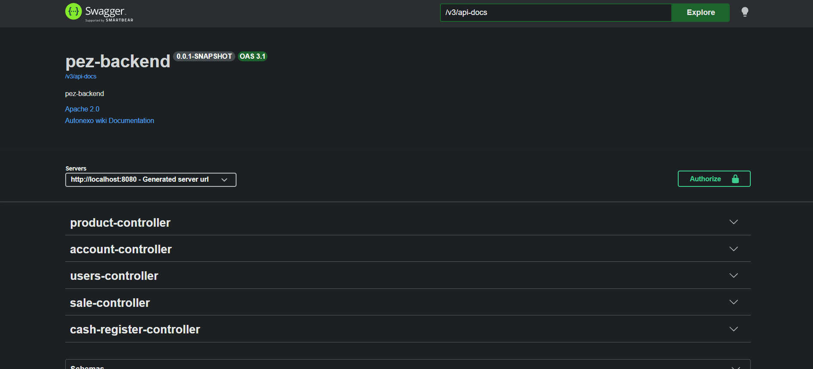
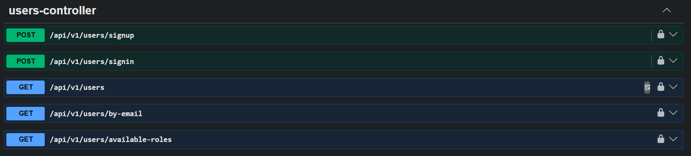
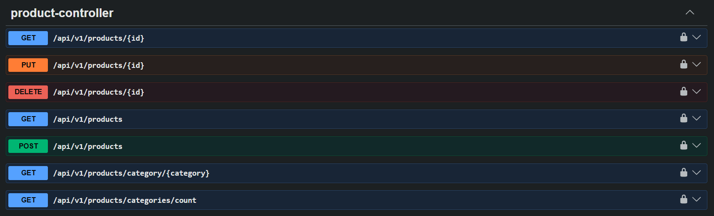
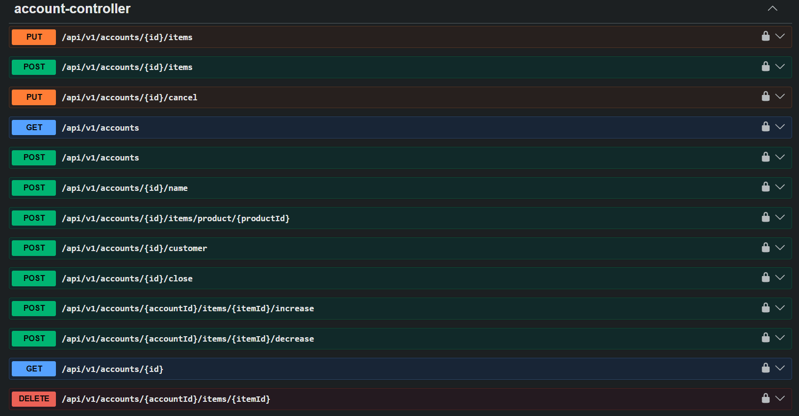
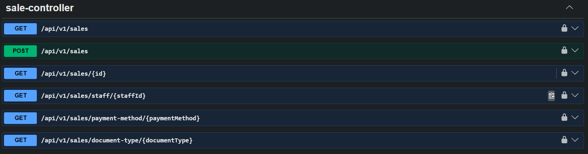
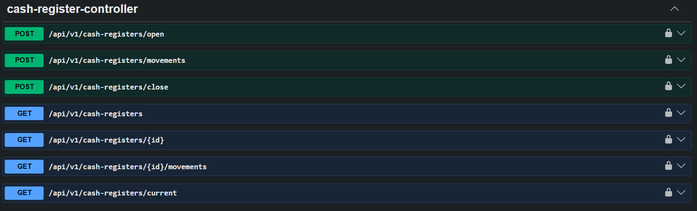

# PEZ Backend System

Backend desarrollado con Spring Boot siguiendo Domain Driven Design (DDD) y arquitectura por Bounded Contexts.
El sistema funciona como un POS (Point of Sale) para gestión de productos, cuentas, ventas y caja.

---

# Descripción del Sistema

El sistema permite:

* Gestión de usuarios y autenticación
* Gestión de productos
* Creación de cuentas
* Generación de ventas
* Registro de pagos
* Control de caja (apertura, movimientos y cierre)

Flujo general del negocio:

Products → Accounts → Sales → Cash Register
↑
Users

---

# Tecnologías

* Java 21
* Spring Boot
* Spring Data JPA
* MySQL
* Maven
* Swagger / OpenAPI
* JWT Authentication
* Lombok
* Hibernate

---

# Arquitectura

El proyecto sigue DDD + Clean Architecture, separando el sistema en Bounded Contexts.

## Estructura del proyecto

```
src/main/java/com/pezbackend
│
├── iam
│   ├── domain
│   ├── application
│   ├── infrastructure
│   └── interfaces
│
├── products
├── accounts
├── billing
├── cashregister
│
├── shared
│   ├── domain
│   ├── infrastructure
│   └── interfaces
│
└── interfaces
    └── rest
        └── exceptionhandling
```

## Estructura interna de cada Bounded Context

```
domain
    services
    model
        aggregates
        entities
        valueobjects
        commands
        queries
        exceptions

application
    internal
        commandservices
        queryservices

infrastructure
    persistence
        repositories

interfaces
    rest
        controllers
        resources
        transformers
```

---

# Bounded Contexts

## IAM

Gestión de usuarios y autenticación.

* Sign Up
* Sign In
* Roles
* JWT

## Products

Gestión de productos y categorías.

## Accounts

Cuentas donde se agregan productos antes de generar la venta.

## Billing

Generación de ventas a partir de cuentas cerradas.

## Cash Register

Gestión de caja, apertura, cierre y movimientos.

---

# Base de Datos

El sistema utiliza MySQL.

Debes crear una base de datos llamada:

```
pez
```

## application.properties

```
spring.datasource.url=jdbc:mysql://localhost:3306/pez
spring.datasource.username=root
spring.datasource.password=tu_password

spring.jpa.hibernate.ddl-auto=update
spring.jpa.show-sql=true
spring.jpa.properties.hibernate.format_sql=true
```

---

# Cómo ejecutar el proyecto en local

## 1. Clonar repositorio

```
git clone https://github.com/tuusuario/pez-backend.git
```

## 2. Crear base de datos en MySQL

```
CREATE DATABASE pez;
```

## 3. Configurar application.properties

Configurar usuario y contraseña de MySQL.

## 4. Ejecutar el proyecto

```
mvn spring-boot:run
```

O ejecutar la clase:

```
PezBackendApplication.java
```

## 5. Swagger

Una vez iniciado el proyecto:

```
http://localhost:8080/swagger-ui/index.html
```

---

# Flujo Normal del Sistema

Flujo típico de una venta:

```
1. Crear Account
2. Agregar productos a Account
3. Cerrar Account
4. Crear Sale desde Account
5. Registrar pagos
6. Si hay efectivo → registrar en Cash Register
7. Sale queda registrada
```

Flujo completo del sistema:

```
ACCOUNT → agregar items
        ↓
ACCOUNT → cerrar cuenta
        ↓
SALE → crear venta desde account
        ↓
SALE → agregar pagos
        ↓
SALE → validar pagos
        ↓
ACCOUNT → marcar como pagada
        ↓
CASH REGISTER → registrar ingreso en efectivo
```

---

# Endpoints por módulo

## Products

```
GET     /api/v1/products
GET     /api/v1/products/{id}
POST    /api/v1/products
PUT     /api/v1/products/{id}
DELETE  /api/v1/products/{id}
GET     /api/v1/products/category/{category}
GET     /api/v1/products/categories/count
```

## Accounts

```
GET     /api/v1/accounts
GET     /api/v1/accounts/{id}
POST    /api/v1/accounts
POST    /api/v1/accounts/{id}/name
POST    /api/v1/accounts/{id}/customer
POST    /api/v1/accounts/{id}/items/product/{productId}
POST    /api/v1/accounts/{accountId}/items/{itemId}/increase
POST    /api/v1/accounts/{accountId}/items/{itemId}/decrease
DELETE  /api/v1/accounts/{accountId}/items/{itemId}
POST    /api/v1/accounts/{id}/close
PUT     /api/v1/accounts/{id}/cancel
```

## Users / IAM

```
POST    /api/v1/users/signup
POST    /api/v1/users/signin
GET     /api/v1/users
GET     /api/v1/users/by-email
GET     /api/v1/users/available-roles
```

## Sales / Billing

```
GET     /api/v1/sales
GET     /api/v1/sales/{id}
POST    /api/v1/sales
GET     /api/v1/sales/staff/{staffId}
GET     /api/v1/sales/payment-method/{paymentMethod}
GET     /api/v1/sales/document-type/{documentType}
```

## Cash Register

```
POST    /api/v1/cash-registers/open
POST    /api/v1/cash-registers/movements
POST    /api/v1/cash-registers/close
GET     /api/v1/cash-registers
GET     /api/v1/cash-registers/{id}
GET     /api/v1/cash-registers/{id}/movements
GET     /api/v1/cash-registers/current
```

---

# Reglas de Negocio Importantes

```
- No se puede crear una venta si la cuenta no está cerrada
- Los pagos deben ser iguales al total de la venta
- Solo pagos en efectivo se registran en caja
- No se puede agregar movimientos si la caja está cerrada
- Solo puede haber una caja abierta
- No se puede cerrar caja sin movimientos
```

---

# Swagger Screenshots

## Docs



## Swagger - Users


## Swagger - Products


## Swagger - Accounts


## Swagger - Sales


## Swagger - Cash Register



# Autor

Victor Andres Cruz Ibarra | andrestheb@gmail.com | +51960938630

Proyecto backend POS desarrollado con Spring Boot, DDD y Clean Architecture.
